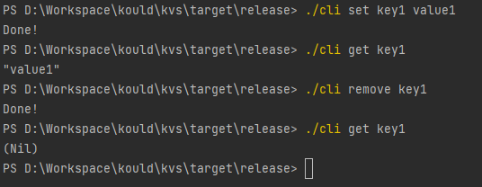
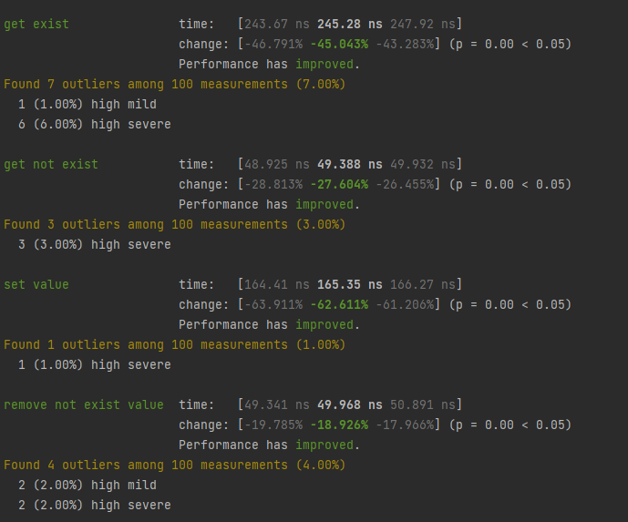

# KipDB

#### 介绍
网络异步交互、零拷贝的轻量级KV数据库

基于PingCAP课程talent-plan
课程地址:https://github.com/pingcap/talent-plan/tree/master/courses/rust

#### 架构
```
|- src
    |- bench 性能基准测试
        |- core_bench.rs 内核性能基准测试
    |- bin 二进制
        |- cli.rs 客户端
        |- server.rs 服务端
    |- cmd 指令
        |- mod.rs 指令定义
    |- core 内核
        |- hash_kv.rs 基于Hash的KVStore
        |- mod.rs KVStore Trait与读写操作封装
    |- net 网络
        |- client.rs 网络客户端
        |- codec.rs 数据帧编码器
        |- connection.rs 网络连接
        |- mod.rs 指令网络定义
        |- server.rs 网络监听服务端
    |- config.rs 预留的配置文件
    |- error.rs 错误定义
    |- lib.rs 模块管理
```

### 使用说明
#### 拉取代码编译
1. 克隆该仓库
  - https://github.com/KKould/KipDB.git
2. 运行编译指令(需要安装rust环境)
  - cargo build --release
3. 进入target/release目录下获取执行文件
  - server.exe 和 cli.exe (window平台为例)
#### 执行操作
  - 运行server服务端
    - ./server 默认端口为6333
    - ./server -help 可以查看指令详情
  - 使用cli客户端进行指令操作
    - ./cli set key1 value1 (示例)
#### 操作示例
  - 


#### 参与贡献

1.  Fork 本仓库
2.  新建 Feat_xxx 分支
3.  提交代码
4.  新建 Pull Request


#### Bench测试

- **执行性能基准测试**
  - cargo bench
- **性能评测**
  - ##### Criterion性能图表
    - 
    - 
